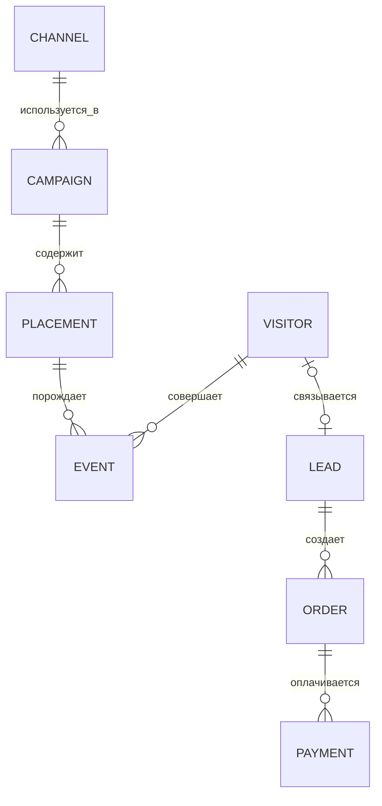

# Концептуальная модель

Статус: черновик для совместного утверждения.

## Стабильное ядро

### Смысл сущностей

| Сущность | Что хранит |
| --- | --- |
| Channel | Telegram-канал или другой источник трафика |
| Campaign | маркетинговую инициативу и период |
| Placement | конкретный рекламный пост/размещение, стоимость и целевой курс |
| Visitor | анонимного посетителя сайта |
| Event | факт клика или действия с временем и источником |
| Lead | обращение к менеджеру, связанное с посетителем при возможности |
| Order | намерение купить выбранный курс |
| Payment | подтверждённый денежный факт |

Атрибуция не меняет исходные события и оплаты. Она создаёт отдельные расчётные результаты: какой модели, версии и доле выручки соответствует каждое касание.

## Почему модель расширяется без полного переделывания

- Telegram collector добавляет `post` и события синхронизации, но `placement` остаётся прежним.
- NLP добавляет классификацию и признаки к `post`, не меняя оплату и воронку.
- Multi-touch добавляет несколько attribution credit на одну оплату.
- Incrementality добавляет эксперименты, группы и оценки эффекта.
- Forecasting читает агрегаты по времени и сохраняет прогнозы отдельно.

Полная переделка понадобится только при ошибке в самом ядре — например, если напрямую привязать оплату к одному рекламному размещению или хранить всю воронку одной широкой строкой.
