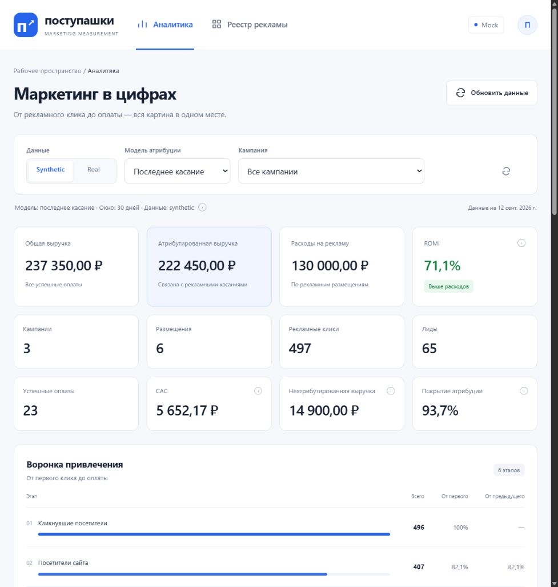
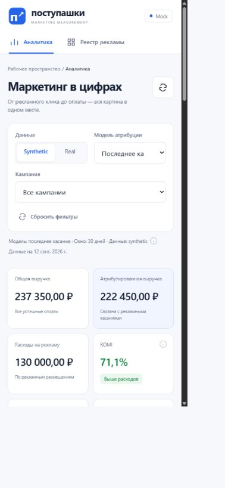

# Frontend «Поступашки»

JavaScript/Vite-интерфейс для маркетинговой аналитики и реестра рекламы.
Визуализации построены на Chart.js. Экономические формулы выполняются на
backend; frontend запрашивает готовые метрики и форматирует их для показа.

## Самый быстрый запуск

Из корня всего репозитория дважды нажмите `docker-start.bat` или выполните:

```powershell
docker compose up --build -d
```

После сборки интерфейс доступен на <http://127.0.0.1:8080/> и уже подключён
к FastAPI и большой synthetic-базе. Node.js отдельно устанавливать не нужно.
Инструкция ниже нужна только для ручной frontend-разработки без Docker.

## Режимы данных

| `VITE_DATA_SOURCE` | Источник | Назначение |
| --- | --- | --- |
| `api` | FastAPI по `VITE_API_BASE_URL` | Работа с выбранной SQLite-базой |
| `mock` | JSON из `public/mock/` | Автономный просмотр интерфейса |

Активный источник отображается в правом верхнем углу страницы. API-режим
не переключается на mock автоматически при ошибке backend.

## Запуск с FastAPI

Сначала запустите backend из корня репозитория:

```powershell
.\.venv\Scripts\Activate.ps1
$env:DATABASE_URL = "sqlite:///data/postupashki_mvp_large_demo.sqlite3"
python -m uvicorn postupashki_mvp.api:app --host 127.0.0.1 --port 8000
```

Затем в другом терминале:

```powershell
cd frontend
Copy-Item .env.example .env.local
notepad .env.local
npm ci
npm run dev -- --port 5174
```

Укажите в `.env.local`:

```dotenv
VITE_DATA_SOURCE=api
VITE_API_BASE_URL=http://127.0.0.1:8000
```

Откройте <http://127.0.0.1:5174/>. Backend разрешает локальные Vite-origin
`http://127.0.0.1:5173` и `http://127.0.0.1:5174`.

Переменные `VITE_*` подставляются Vite при запуске или сборке и не должны
содержать секреты. После их изменения перезапустите dev server.

## Mock-режим

В `.env.local` укажите:

```dotenv
VITE_DATA_SOURCE=mock
VITE_API_BASE_URL=http://127.0.0.1:8000
```

После `npm run dev` FastAPI не требуется. Mock-снимки находятся в
`public/mock/*.json`. Созданные через формы записи живут только в памяти
вкладки и исчезают после перезагрузки.

## Что реализовано

- общая аналитическая сводка и 12 KPI;
- воронка привлечения;
- графики выручки, расходов и ROMI;
- таблицы кампаний и размещений;
- фильтры synthetic/real, модели атрибуции и кампании;
- проверка качества данных;
- создание кампаний и размещений;
- tracking-ссылки и копирование в буфер;
- пустые, ошибочные и загрузочные состояния;
- адаптивная вёрстка.

CAC в текущем MVP означает стоимость успешной оплаты. При `linear`
интерфейс показывает взвешенные эквиваленты оплат.

## Используемый API

| Метод клиента | HTTP |
| --- | --- |
| `getSummary(filters)` | `GET /analytics/summary` |
| `getCampaignMetrics(filters)` | `GET /analytics/campaigns` |
| `getFunnel(filters)` | `GET /analytics/funnel` |
| `getPlacementMetrics(filters)` | `GET /analytics/placements` |
| `getDataQuality(filters)` | `GET /data-quality/summary` |
| `getCampaigns()` | `GET /campaigns` |
| `createCampaign(payload)` | `POST /campaigns` |
| `getPlacements(campaignId)` | `GET /placements?campaign_id=...` |
| `createPlacement(payload)` | `POST /placements` |

Аналитические запросы передают `data_kind`, `attribution_model` и
необязательный `campaign_id`. HTTP-клиент использует тайм-аут 12 секунд и
преобразует ошибки FastAPI в сообщения интерфейса.

## Проверки

```powershell
npm ci
npm test
npm run lint
npm run build
```

Для локального просмотра production-сборки:

```powershell
npm run preview
```

## Ограничения

- нет авторизации и ролей;
- нет редактирования и удаления существующих записей;
- нет пагинации и production-деплоя;
- mock-аналитика не пересчитывается после создания записей.

## Скриншоты




