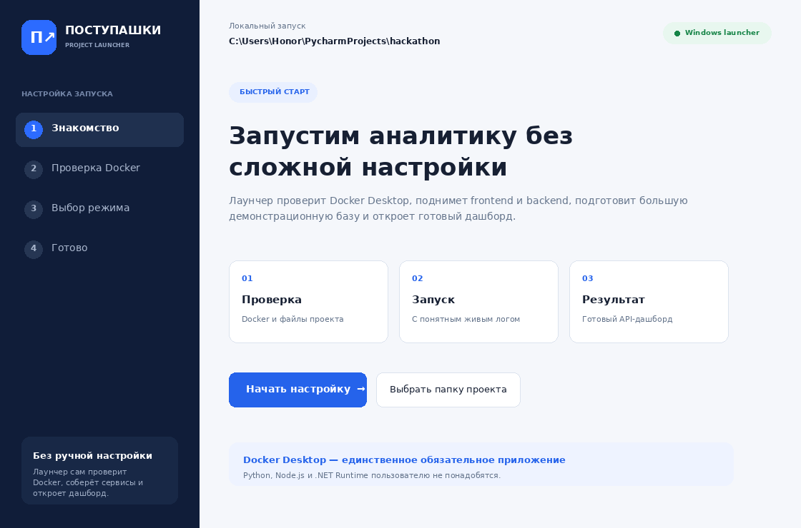

# Windows-лаунчер «Поступашки»

`PostupashkiLauncher.exe` — необязательная графическая оболочка над Docker
Compose. Она не содержит backend, frontend или базу внутри себя и не заменяет
Docker Desktop.



## Что умеет лаунчер

- находит корень проекта или предлагает выбрать `compose.yaml`;
- проверяет наличие Docker CLI и доступность Docker Engine;
- пытается запустить Docker Desktop, если он остановлен;
- объясняет разницу между обычным и чистым запуском;
- выполняет `docker compose up --build -d` и показывает живой лог;
- ожидает успешный `/health` перед экраном «Готово»;
- открывает дашборд и Swagger;
- останавливает контейнеры без удаления demo-данных;
- удаляет Docker volume только после отдельного подтверждения пользователя.

Локальные файлы `data/*.sqlite3` лаунчер не читает, не изменяет и не удаляет.

## Локальная сборка

Нужен .NET 8 SDK. Из корня репозитория дважды запустите
`build-launcher.bat` или выполните:

```powershell
dotnet publish launcher/Postupashki.Launcher.csproj `
  --configuration Release `
  --runtime win-x64 `
  --self-contained true `
  --output launcher/publish
```

Результат: `launcher/publish/PostupashkiLauncher.exe`. Это self-contained
Windows x64 приложение: на компьютере пользователя не нужен .NET Runtime.

## Сборка в GitHub Actions

Workflow `.github/workflows/build-launcher.yml` можно запустить вручную на вкладке
**Actions → Build Windows launcher → Run workflow**. Готовый EXE появится в
artifact `postupashki-windows-launcher`.

Чтобы workflow одновременно создал GitHub Release:

```powershell
git tag launcher-v1.0.0
git push origin launcher-v1.0.0
```

## Распространение

Пользователь кладёт `PostupashkiLauncher.exe` в корень клонированного проекта
рядом с `compose.yaml` и запускает двойным нажатием. Если EXE находится в другом
месте, на первом экране можно выбрать `compose.yaml` вручную.

Неподписанный EXE может вызвать предупреждение Windows SmartScreen. Для публичного
распространения без такого предупреждения потребуется сертификат подписи кода;
это не влияет на работу самого лаунчера.
